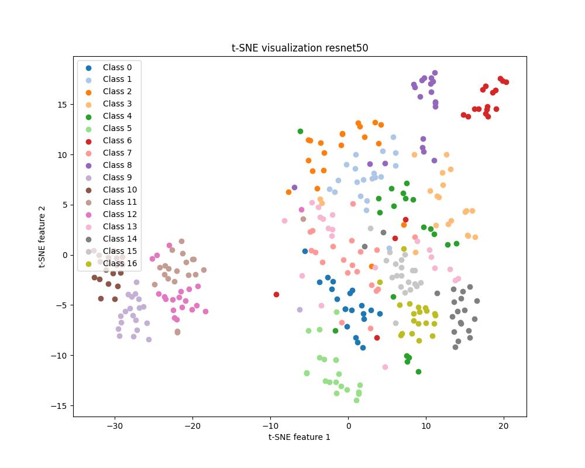
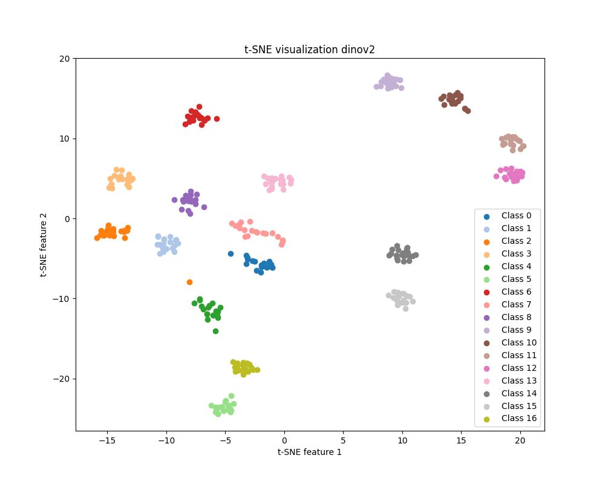
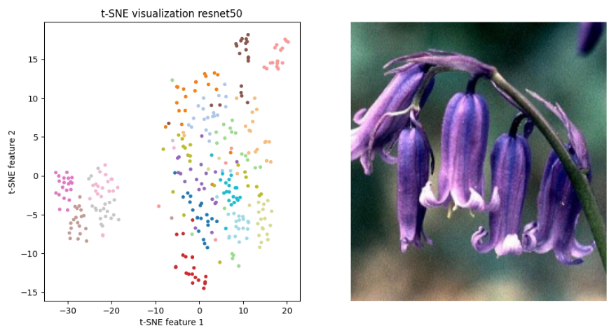
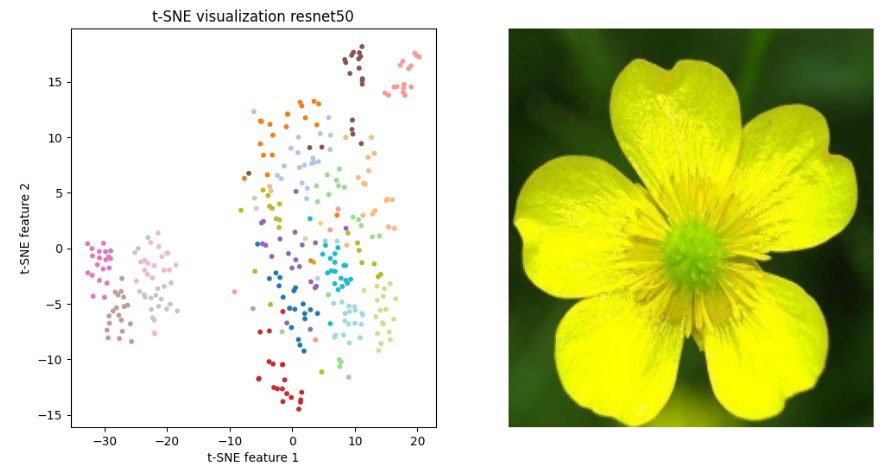

# DINOv2_classification
Flower classification with DINOv2

## Install
Run `source scripts/install.sh`.

## Data

### 17 Category Flower Dataset
A 17 category flower dataset with 80 images for each class. Randomly split the dataset into 3 different training, validation and test sets.

### Download
[Link](https://www.robots.ox.ac.uk/~vgg/data/flowers/17/)

Please save the data as below:

```
data
 ┣Flower
  ┣ jpg
  ┃ ┣ files.txt
  ┃ ┣ image_0001.jpg
  ┃ ┣ image_0002.jpg
  ┃ ┣ ...
  ┃ ┗ image_1360.jpg
  ┗ datasplits.mat
```

## Results (TSNE)
Run `source scripts/tsne.sh`.

<p float="left">
  
  
</p>

You can interact in the figure by running `source scripts/tsne_interactive.sh`.

<p float="left">
  
  
</p>

## Results (Classification)
Train 5 epochs.

### Resnet 50 + Classifier head
```
Epoch: 1 | train loss: 2.7797 | train acc: 2.4 | valid loss: 2.6566 | valid acc: 12.3 
Save best model at epoch 1.
Epoch: 2 | train loss: 2.5889 | train acc: 15.0 | valid loss: 2.5042 | valid acc: 28.9 
Save best model at epoch 2.
Epoch: 3 | train loss: 2.4263 | train acc: 42.3 | valid loss: 2.3996 | valid acc: 50.3 
Save best model at epoch 3.
Epoch: 4 | train loss: 2.3427 | train acc: 57.7 | valid loss: 2.3335 | valid acc: 60.6 
Save best model at epoch 4.
Epoch: 5 | train loss: 2.2982 | train acc: 66.2 | valid loss: 2.3178 | valid acc: 64.2 
Save best model at epoch 5.
Test loss: 2.2783 | test acc: 67.6
```

### DINOv2 + Classifier head
```
Epoch: 1 | train loss: 2.5425 | train acc: 23.4 | valid loss: 2.1657 | valid acc: 72.8 
Save best model at epoch 1.
Epoch: 2 | train loss: 2.0407 | train acc: 87.2 | valid loss: 1.9574 | valid acc: 97.9 
Save best model at epoch 2.
Epoch: 3 | train loss: 1.9418 | train acc: 99.0 | valid loss: 1.9346 | valid acc: 100.0 
Save best model at epoch 3.
Epoch: 4 | train loss: 1.9317 | train acc: 99.9 | valid loss: 1.9340 | valid acc: 99.7 
Epoch: 5 | train loss: 1.9307 | train acc: 100.0 | valid loss: 1.9339 | valid acc: 99.7 
Test loss: 1.9339 | test acc: 99.6
```
